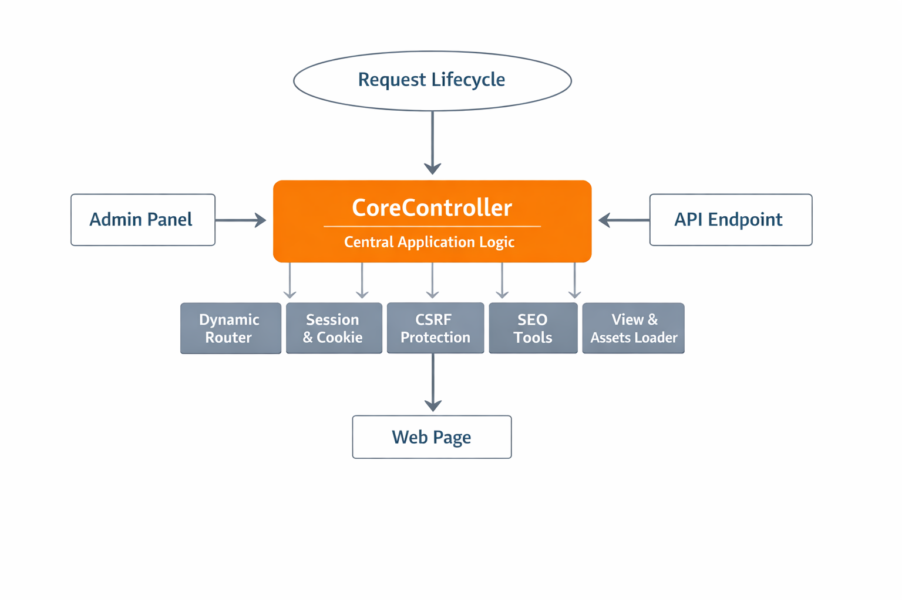
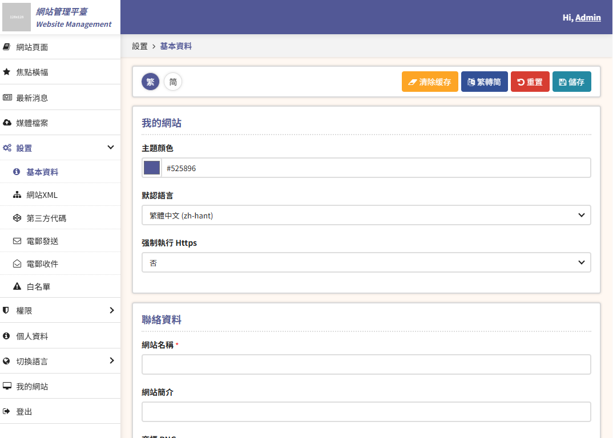

**Description:**  
A battle-tested Laravel development kit for rapid project setup. Build websites and web apps faster with dynamic routing, reusable components, and built-in CMS features.

**Highlights:**

-   ⚡ **Rapid Development:** Pre-built core and utilities to jumpstart projects.
    
-   🛠️ **CMS Features:** Pages, posts, media library, and content management.
    
-   🔑 **User & Role Management:** Admin panel for users, roles, and permissions.
    
-   🌐 **SEO & Routing:** SEO-friendly defaults with dynamic route handling.
    
-   📧 **Email Ready:** Configurable SMTP and SendGrid integration.
    
-   🗄️ **Reusable Tools:** Session, cookie, and data utilities used in multiple live projects.
    

**Perfect for:** Developers who want a solid Laravel foundation to launch projects quickly without reinventing the wheel.

## Frond End:
https://xxxx.com/

## Back End:
https://xxxx.com/admin
Backend user: admin / Abc123
